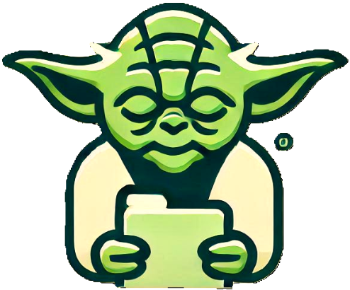

# YodaDone

  

A collaborative to-do list app for families, friends, and coworkers. Get things done, Yoda-style! Whether you're managing tasks together or just need to keep track of your own to-do's, YodaDone makes it easy, fun, and efficient.

## Features

- **Collaborative Task Lists**: Share and work on lists with others in real-time.
- **Easy Authentication**: Sign in with federated login options (Google, Facebook, etc.).
- **Persistent Data**: Tasks and lists are securely saved and synced across devices.
- **Web and iOS Support**: Access your tasks from both your browser and mobile device.
- **Cost-effective Hosting**: Built for scalability and minimal hosting costs, hosted on AWS or Cloudflare.
- **Simple UI/UX**: A clean, user-friendly interface for smooth task management.

## Setup

TODO
